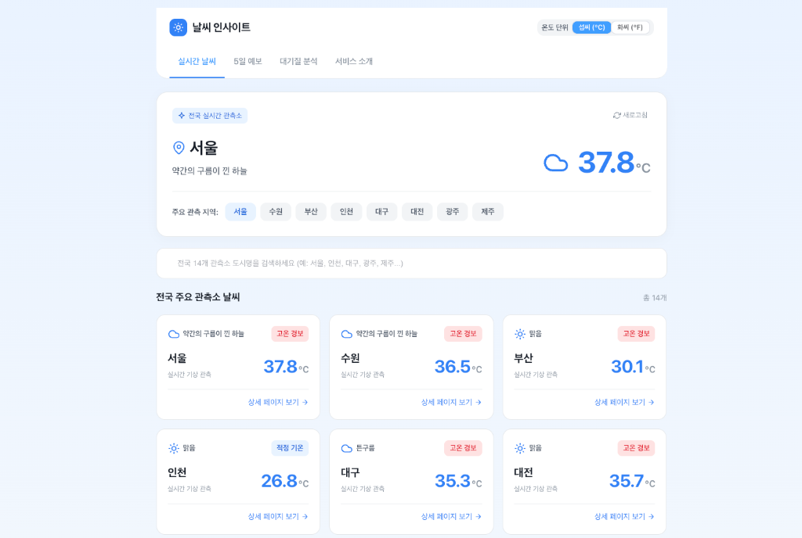
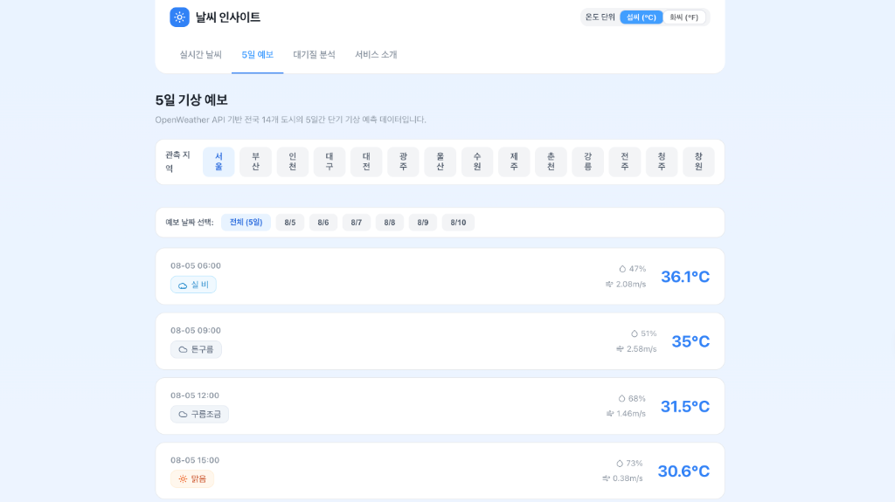
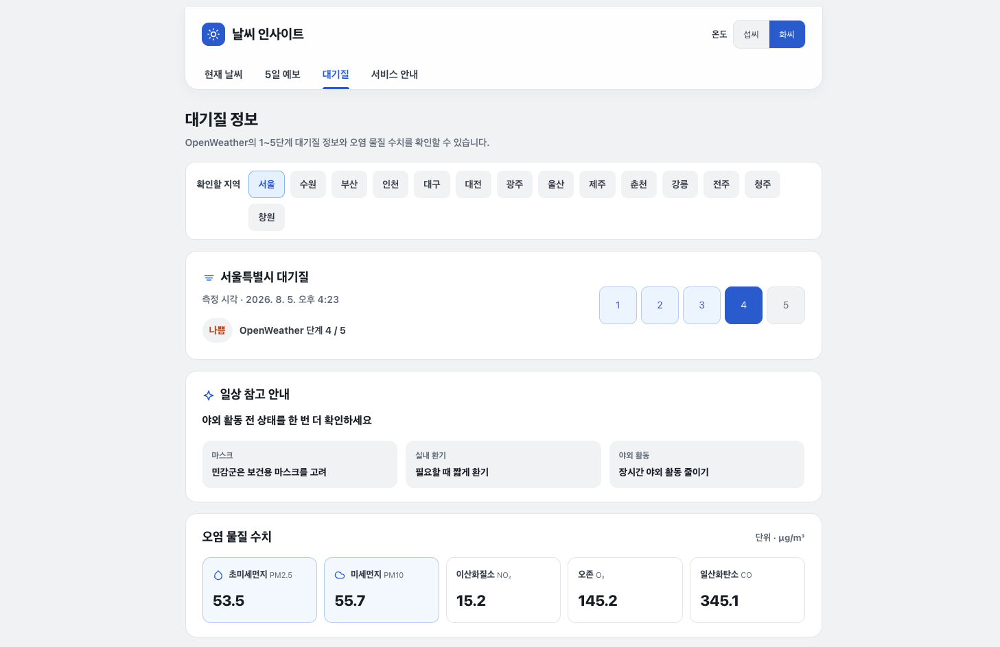
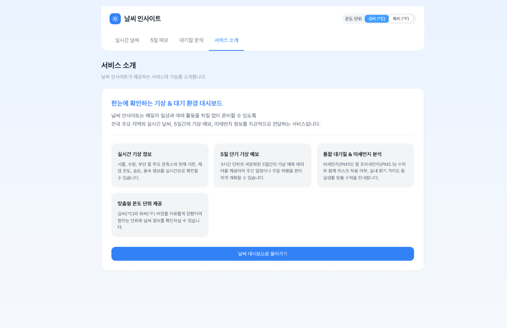

# 날씨 인사이트

대한민국 주요 14개 도시의 현재 날씨, 5일 예보, 대기질 정보를 한곳에서 살펴볼 수 있는 Vue 기반 웹 대시보드입니다. 도시를 검색하거나 선택해 필요한 정보를 빠르게 확인할 수 있고, 화면 상단에서 섭씨와 화씨를 바꿔 볼 수 있습니다.

[서비스 열기](https://weather-insight-ko.vercel.app/)

## 주요 기능

- **현재 날씨**: 서울, 수원, 부산, 인천 등 14개 도시의 현재 기온과 날씨 상태를 카드로 확인합니다. 도시명 검색, 상세 화면 이동, 마지막 갱신 시각 확인을 지원합니다.
- **도시별 상세 정보**: 현재 기온, 체감 온도, 날씨 상태, 습도, 풍속, 기압을 제공합니다. 상세 화면에서도 다른 도시로 바로 전환할 수 있습니다.
- **5일 예보**: 선택한 도시의 3시간 단위 예보를 날짜별로 나누어 한국 표준시 기준으로 볼 수 있습니다. 예보 카드에는 기온, 습도, 풍속, 강수 확률과 날씨 상태가 표시됩니다.
- **대기질 정보**: OpenWeather의 1~5단계 대기질 정보와 PM2.5, PM10, NO₂, O₃, CO 수치를 확인할 수 있습니다. 단계에 맞춘 일상 참고 안내도 함께 보여 줍니다.
- **온도 단위 전환**: 상단의 단위 선택에서 섭씨(°C)와 화씨(°F)를 바꾸면 현재 화면의 온도 표기가 함께 바뀌며, 선택값은 브라우저에 저장됩니다.
- **오류 및 빈 상태 안내**: API 응답을 받지 못하거나 검색 결과가 없을 때 상황을 알리고, 화면에서 바로 다시 시도할 수 있습니다.

## 화면

| **현재 날씨** | **5일 예보** |
| :---: | :---: |
|  |  |
| **대기질** | **서비스 소개** |
|  |  |

## 시작하기

### 준비 사항

- Node.js `20.19.0` 이상 또는 `22.12.0` 이상
- [OpenWeather](https://openweathermap.org/api) API 키

### 1. 의존성 설치

```bash
npm install
```

### 2. 환경 변수 설정

프로젝트 루트에 `.env.local` 파일을 만들고 OpenWeather API 키를 입력합니다.

```env
VITE_OPENWEATHER_API_KEY=your_openweather_api_key
```

`VITE_`로 시작하는 환경 변수는 Vite 빌드 결과에 포함됩니다. 배포용 키는 OpenWeather에서 사용 범위와 제한을 설정한 별도 키로 관리하는 편이 좋습니다.

### 3. 개발 서버 실행

```bash
npm run dev
```

터미널에 표시되는 로컬 주소로 접속하면 됩니다. API 키를 새로 입력하거나 변경했다면 개발 서버를 다시 시작하세요.

## 사용할 수 있는 명령어

| 명령어 | 설명 |
| :--- | :--- |
| `npm run dev` | Vite 개발 서버를 실행합니다. |
| `npm run build` | 배포용 정적 파일을 `dist`에 생성합니다. |
| `npm run preview` | 빌드된 결과를 로컬에서 미리 봅니다. `npm run build` 후 사용하세요. |
| `npm run lint` | Oxlint와 ESLint를 실행하고 가능한 항목은 자동으로 수정합니다. 실행 뒤 변경 사항을 확인하세요. |
| `npm run format` | `src` 디렉터리의 파일을 Prettier로 정리합니다. 이 명령은 파일을 직접 수정합니다. |

## 데이터 범위와 참고 사항

- 날씨와 예보, 대기질 데이터는 OpenWeather API에서 가져옵니다. 데이터의 갱신 시점과 제공 범위는 OpenWeather의 응답 및 요금제에 따라 달라질 수 있습니다.
- 지원 도시는 서울, 수원, 부산, 인천, 대구, 대전, 광주, 울산, 제주, 춘천, 강릉, 전주, 청주, 창원입니다.
- 대기질 행동 안내는 OpenWeather의 1~5단계에 따른 참고용 정보입니다. 건강 관련 판단이나 재난 상황에서는 공공기관의 공식 안내를 우선해 주세요.

## 구성

- Vue 3 + Vite
- Vue Router
- Pinia
- Element Plus
- Axios
- OpenWeather API
